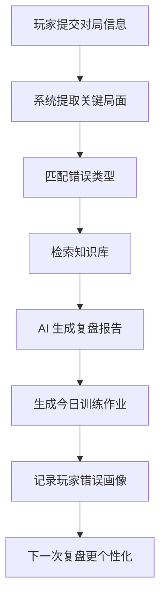

# 火影忍者手游决斗场 AI 复盘教练产品蓝图

## 1. 产品一句话

面向决斗场玩家的网页复盘教练：玩家提交一局对战信息后，系统基于知识库分析关键失误、给出更优处理方式，并生成适合当前水平的训练作业。

## 2. 第一阶段定位

第一阶段建议做“赛后复盘 + 训练作业”，不要做实时辅助。

原因：

- 赛后复盘更符合学习产品定位，合规风险更低。
- 不依赖游戏接口，用户可以手动填写、上传截图或上传录像片段。
- AI 的输出可以被知识库约束，降低幻觉。
- 容易形成可复用数据：失误类型、忍者 matchup、训练计划、玩家成长记录。

## 3. 核心用户

### 入门玩家

典型问题：

- 不知道自己为什么输。
- 替身、奥义、技能释放时机混乱。
- 看攻略看不懂，缺少“针对我这一局”的解释。

产品价值：

- 把一局输法拆成 1 到 3 个最关键问题。
- 给出容易执行的下一局提醒。
- 用简单训练作业替代泛泛攻略。

### 中阶玩家

典型问题：

- 知道概念，但实战用不出来。
- 会连招，但不会骗替、抓后摇、控资源。
- 某些忍者或阵容一遇到就输。

产品价值：

- 给出 matchup 思路。
- 识别重复失误模式。
- 按段位和常用忍者生成训练计划。

### 高阶玩家

典型问题：

- 想提高稳定性和对局细节。
- 希望管理自己的复盘笔记和版本知识。

产品价值：

- 形成个人错误画像。
- 按对手类型和忍者池做专项训练。
- 沉淀自己的私有知识库。

## 4. MVP 功能范围

### 必做

1. 对局信息提交

- 当前段位
- 玩家使用忍者
- 对手使用忍者
- 胜负结果
- 玩家自认为输的原因
- 关键片段描述或上传录像

2. AI 复盘报告

- 本局最大问题
- 3 个关键失误
- 每个失误的原因
- 推荐处理方式
- 依据来源
- 下一局提醒

3. 个性化训练作业

- 今日训练重点
- 练习局数
- 观察指标
- 完成后复盘问题

4. 知识库后台

- 通用机制知识
- 忍者打法知识
- matchup 知识
- 错误类型库
- 训练作业库

### 暂缓

- 实时对局提醒
- 自动操作
- 完整录像自动识别
- 版本强度榜自动生成
- 无依据的“最优解”断言

## 5. 推荐页面结构

### 工作台

展示玩家最近问题、训练目标、最近复盘结果。

### 提交对局

让玩家用低门槛方式提交一局：

- 快速模式：手动描述 3 个关键回合。
- 标准模式：填写完整对局信息。
- 进阶模式：上传录像并人工标记时间点。

### 复盘报告

核心页面，建议结构：

1. 本局结论
2. 关键时间线
3. 错误分析
4. 推荐解
5. 知识依据
6. 今日作业

### 知识库

给运营者或高阶用户维护资料：

- 机制条目
- 忍者条目
- matchup 条目
- 错误类型
- 训练模板

### 成长记录

追踪玩家一段时间内的问题变化：

- 替身乱交次数
- 技能空放次数
- 奥义收益
- 起手成功率
- 被反打原因
- 最近 7 天训练完成情况

## 6. AI 回答约束

AI 每次回答都必须遵守：

1. 只根据用户提交信息和知识库回答。
2. 不确定时明确说“不足以判断”。
3. 每条关键建议都要带知识依据。
4. 不使用“必胜”“绝对最优”等表达。
5. 输出要按玩家水平调整难度。
6. 没有对应忍者资料时，只能给通用原则，不能编 matchup。

## 7. 知识库结构建议

### 机制知识

```json
{
  "id": "mechanic_substitution_001",
  "title": "替身使用原则",
  "category": "mechanic",
  "level": "beginner",
  "content": "替身通常用于打断对方稳定收益，而不是在低伤害试探命中后立刻交出。",
  "applicable_when": ["被命中", "对手可继续连段", "自身有反打资源"],
  "avoid_when": ["对手伤害较低", "对手技能未交完", "自身反打距离不足"]
}
```

### 错误类型

```json
{
  "id": "mistake_skill_whiff_001",
  "title": "无保护技能空放",
  "symptom": "玩家在对手可反打距离内释放技能但未命中。",
  "risk": "进入技能真空期，被对手抓后摇或压场。",
  "recommended_response": "优先拉开距离或使用位移规避，等待技能冷却后再重新争夺先手。",
  "training_plan_id": "training_skill_confirm_001"
}
```

### 训练作业

```json
{
  "id": "training_substitution_001",
  "title": "替身延迟判断训练",
  "target_level": ["beginner", "intermediate"],
  "task": "接下来 5 局只记录自己每一次替身原因。",
  "success_metric": "低伤害命中后立刻替身的次数下降。",
  "review_question": "这次替身换来了反打、逃生，还是只是交掉资源？"
}
```

## 8. 核心流程



## 9. 技术方案

### 第一版

- 前端：网页工作台，支持表单、报告、知识库管理。
- 后端：用户、对局、知识库、复盘报告。
- AI：基于检索增强生成。
- 数据：先使用人工提交和人工标记，降低识别难度。

### 第二版

- 支持上传录像。
- 用户手动标记关键时间点。
- 系统根据时间点生成结构化事件。
- AI 按事件复盘。

### 第三版

- 尝试识别血量、时间、技能冷却、奥义点、替身状态。
- 建立自动事件流。
- 做更细的局面判断。

## 10. 复盘报告模板

```text
本局核心问题：
你输的主要原因不是连招伤害不够，而是技能空放后仍然继续前压，导致连续被反打。

关键失误 1：
00:23 你在对手替身仍在的情况下直接追击，收益不稳定。

为什么有问题：
对手还有替身时，强追容易让自己进入后摇或技能真空期。

推荐处理：
先压距离，逼对手交技能或替身，再确认连段。

知识依据：
替身使用原则、技能真空期处理、压场节奏基础。

今日作业：
接下来 5 局只练一个目标：技能没命中时，第一反应后撤，不追加第二个技能。
```

## 11. 商业化可能

### 免费层

- 每日 1 到 3 次复盘
- 通用知识库
- 基础训练作业

### 订阅层

- 更多复盘次数
- 个人错误画像
- 高级 matchup 知识
- 训练计划追踪
- 私有笔记库

### 高阶服务

- 人工教练标注
- 高手知识库
- 战队训练空间

## 12. 成败关键

这个产品的成败不取决于 AI 说得多漂亮，而取决于三件事：

1. 复盘是否具体到玩家这一局。
2. 建议是否有知识依据。
3. 作业是否能让玩家下一局真的变好一点。

